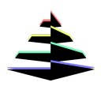

<div id="top"></div>

[![Contributors][contributors-shield]][contributors-url]
[![Forks][forks-shield]][forks-url]
[![Stargazers][stars-shield]][stars-url]
[![Issues][issues-shield]][issues-url]
[![MIT License][license-shield]][license-url]

<!-- PROJECT LOGO -->
<br />
<div align="center">
  <a href="https://github.com/prsm/crystal-nest">
    
  </a>

<h3 align="center">crystal-nest</h3>

  <p align="center">
    A Nest rewrite of crystal, the SOS Discord bot
    <br />
    <a href="https://github.com/prsm/crystal-nest"><strong>Explore the docs »</strong></a>
    <br />
    <br />
    <a href="https://github.com/prsm/crystal-nest/issues">Report Bug</a>
    ·
    <a href="https://github.com/prsm/crystal-nest/issues">Request Feature</a>
  </p>
</div>

<!-- TABLE OF CONTENTS -->
<details>
  <summary>Table of Contents</summary>
  <ol>
    <li>
      <a href="#about-the-project">About The Project</a>
      <ul>
        <li><a href="#built-with">Built With</a></li>
      </ul>
    </li>
    <li>
      <a href="#getting-started">Getting Started</a>
      <ul>
        <li><a href="#prerequisites">Prerequisites</a></li>
        <li><a href="#installation">Installation</a></li>
      </ul>
    </li>
    <li><a href="#usage">Usage</a></li>
    <li><a href="#roadmap">Roadmap</a></li>
    <li><a href="#contributing">Contributing</a></li>
    <li><a href="#license">License</a></li>
    <li><a href="#contact">Contact</a></li>
    <li><a href="#acknowledgments">Acknowledgments</a></li>
  </ol>
</details>

<!-- ABOUT THE PROJECT -->

## About The Project

A Nest rewrite of crystal, the SOS Discord bot.

<p align="right">(<a href="#top">back to top</a>)</p>

### Built With

- [NestJS](https://nestjs.com/)
- [discord-nestjs](https://github.com/fjodor-rybakov/discord-nestjs)
- [Prisma](https://www.prisma.io/)
- [Docker](https://www.docker.com/)
- [Docker Compose](https://docs.docker.com/compose/)

<p align="right">(<a href="#top">back to top</a>)</p>

<!-- GETTING STARTED -->

## Getting Started

This is an example of how you may give instructions on setting up your project locally.
To get a local copy up and running follow these simple example steps.

### Prerequisites

This application uses a multi-stage docker build, to work both locally and on the server. **Please don't install the dependencies manually**

- Install docker

- Copy the `.env.example` to `.env` and fill it out correctly. The `APP_ENV` flag should be set to `development` if you run it locally and `production` when deploying. This ensures the correctly docker build will be done.

- cd into the directory and run

  ```sh
  docker compose up --build
  ```

<p align="right">(<a href="#top">back to top</a>)</p>

<!-- USAGE EXAMPLES -->

## Usage

Deploy image with a postgres db and see the slash commands.

<p align="right">(<a href="#top">back to top</a>)</p>

<!-- ROADMAP -->

## Roadmap

- [x] Init
- [ ] Events
- [ ] Roles
- [ ] Channels
- [ ] Jira integration

See the [open issues](https://github.com/prsm/crystal-nest/issues) for a full list of proposed features (and known issues).

<p align="right">(<a href="#top">back to top</a>)</p>

<!-- CONTRIBUTING -->

## Contributing

Contributions are what make the open source community such an amazing place to learn, inspire, and create. Any contributions you make are **greatly appreciated**.

If you have a suggestion that would make this better, please fork the repo and create a pull request. You can also simply open an issue with the tag "enhancement".
Don't forget to give the project a star! Thanks again!

1. Fork the Project
2. Create your Feature Branch (`git checkout -b feature/AmazingFeature`)
3. Commit your Changes (`git commit -m 'Add some AmazingFeature'`)
4. Push to the Branch (`git push origin feature/AmazingFeature`)
5. Open a Pull Request

<p align="right">(<a href="#top">back to top</a>)</p>

<!-- LICENSE -->

## License

Distributed under the MIT License. See `LICENSE` for more information.

<p align="right">(<a href="#top">back to top</a>)</p>

<!-- CONTACT -->

## Contact

Jonas Schultheiss - [@SchultheissJ](https://twitter.com/SchultheissJ) - jonas.schultheiss@sos-esports.com

Project Link: [https://github.com/prsm/crystal-nest](https://github.com/prsm/crystal-nest)

<p align="right">(<a href="#top">back to top</a>)</p>

<!-- ACKNOWLEDGMENTS -->

## Acknowledgments

- Product owner [Tobias Zischler](https://github.com/zischler)
- Product owner [Callum Stringer](https://github.com/cstringer17)
- Previous dev [Jasmin](https://github.com/GiyoMoon)

<p align="right">(<a href="#top">back to top</a>)</p>

<!-- MARKDOWN LINKS & IMAGES -->
<!-- https://www.markdownguide.org/basic-syntax/#reference-style-links -->

[contributors-shield]: https://img.shields.io/github/contributors/prsm/crystal-nest.svg?style=for-the-badge
[contributors-url]: https://github.com/prsm/crystal-nest/graphs/contributors
[forks-shield]: https://img.shields.io/github/forks/prsm/crystal-nest.svg?style=for-the-badge
[forks-url]: https://github.com/prsm/crystal-nest/network/members
[stars-shield]: https://img.shields.io/github/stars/prsm/crystal-nest.svg?style=for-the-badge
[stars-url]: https://github.com/prsm/crystal-nest/stargazers
[issues-shield]: https://img.shields.io/github/issues/prsm/crystal-nest.svg?style=for-the-badge
[issues-url]: https://github.com/prsm/crystal-nest/issues
[license-shield]: https://img.shields.io/github/license/prsm/crystal-nest.svg?style=for-the-badge
[license-url]: https://github.com/prsm/crystal-nest/blob/master/LICENSE
